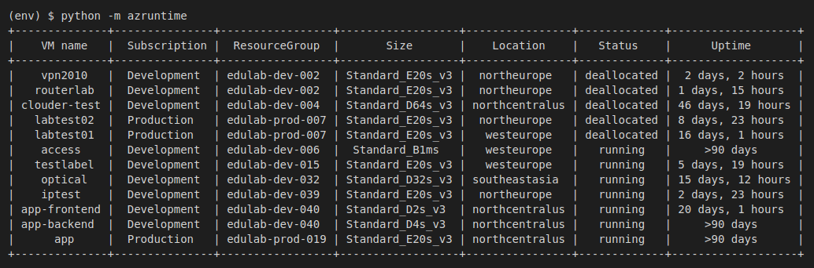

#AzRuntime#

A simple script that lists all VMs running in your subscriptions and displays either:

* For running VMs, the time since the VM was started
* For deallocated VMs, the time since the VM was stopped


## Install ##

To install this script, create a new virtual environment because the azruntime package installs Python packages that conflict with the older versions of those packages installed when you install Azure CLI on your system. 

```
$ mkdir azruntime
$ cd azruntime
$ python -m venv env
$ source env/bin/activate
(env) $ pip install -e "git+https://github.com/blinklet/azure-scripts.git#egg=pkg&subdirectory=azruntime"
```

## Run ##

To run the program, you must already be logged into Azure CLI because the program uses your Azure CLI credentials to authenticate itself with Azure. Then, run the command:

```
(env) $ python -m azruntime
```

Your terminal window width should be around 140 characters so the table displays without wrapping rows.

## Sample output ## 

The program output looks like the following:



