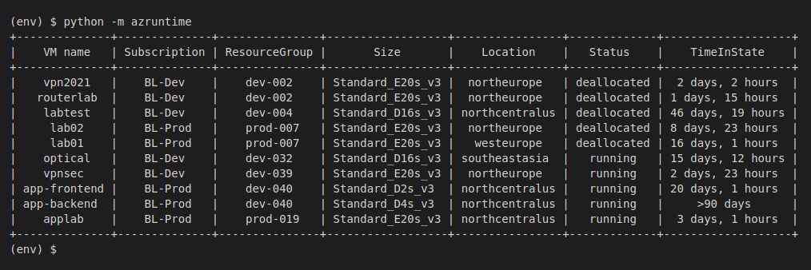

# AzRuntime #

A simple script that lists all VMs running in your subscriptions and displays either:

* For running VMs, the time since the VM was started
* For deallocated VMs, the time since the VM was stopped

You may install *azruntime* using either *pipx* or *pip*. Your terminal window width should be around 140 characters so the table displays without wrapping rows.

## Install as a CLI app using *pipx* ##

To install *azruntime* as a CLI application, use *pipx*. 

First, install *pipx*:

```
$ sudo apt install python3-venv
$ sudo apt install python3-pip
$ python3 -m pip install pipx
$ python3 -m pipx ensurepath
```

Then, exit your terminal and open a new terminal session.

> **NOTE:** do not install *pipx* from your Linux repository (using *apt* or *dnf*, for example). Install it using *pip* as shown above.

Then, install *azruntime* using *pipx*:

```
$ pipx install "git+https://github.com/blinklet/azure-scripts.git#egg=azruntime&subdirectory=azruntime"
```

Now, you can run *azruntime* from the command prompt. *pipx* sets it up so it automatically runs in its own virtual environment.

Run the program with the command:

```
$ azruntime
```

If you install using *pipx*, *azruntime* will ask you to authenticate your Azure credentials using a web browser. For some reason, the Azure CLI authentication does not work when you install the *azruntime* program with *pipx*.

## Install as a Python app using *pip* ##

To install *azruntime* as a Python app, first create a new virtual environment. Then, use *pip* as shown below:

```
$ mkdir azruntime
$ cd azruntime
$ python -m venv env
$ source env/bin/activate
(env) $ pip install "git+https://github.com/blinklet/azure-scripts.git#egg=azruntime&subdirectory=azruntime"
```

To run the program, run the command:

```
(env) $ azruntime
```

When installed as a Python app and run from a virtual environment, *azruntime* can read your Azure CLI credentials, if you are already logged in. If you are not logged in, it will open a browser window and ask you to login.

## Sample output ## 

The program output looks like the following:



